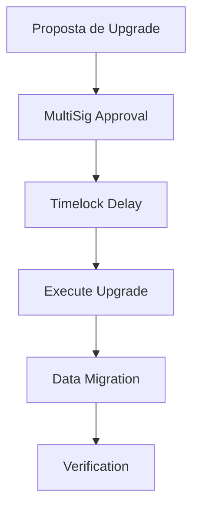

# Aura Lend Protocol - Upgrade Guide

Este guia documenta o sistema de upgradability implementado no protocolo Aura Lend, incluindo como realizar upgrades de programa e migração de dados de forma segura.

## 📋 Visão Geral

O protocolo Aura Lend implementa um sistema robusto de upgradability com:

- **Autoridade de Upgrade Controlada**: MultiSig controla a autoridade de upgrade do programa
- **Sistema de Migração de Dados**: Migração automática entre versões de estado
- **Governança Integrada**: Upgrades requerem aprovação através do sistema RBAC
- **Timelock para Segurança**: Delays obrigatórios para operações críticas
- **Tooling Automatizado**: Scripts para deploy e migração automatizados

## 🏗️ Arquitetura do Sistema

### Hierarquia de Autoridades

```
MultiSig Owner (Market)
    ├── Program Upgrade Authority
    ├── Timelock Controller
    ├── Governance Registry
    └── Emergency Authority
```

### Fluxo de Upgrade



## 🔧 Componentes Principais

### 1. Instruções de Upgrade

#### `set_upgrade_authority`
Define a autoridade de upgrade do programa para o MultiSig.

```rust
pub fn set_upgrade_authority(ctx: Context<SetUpgradeAuthority>) -> Result<()>
```

#### `upgrade_program` 
Executa upgrade do programa usando um buffer account.

```rust
pub fn upgrade_program(ctx: Context<UpgradeProgram>) -> Result<()>
```

#### `freeze_program`
Remove permanentemente a autoridade de upgrade.

```rust
pub fn freeze_program(ctx: Context<FreezeProgram>) -> Result<()>
```

### 2. Sistema de Migração

#### Trait `Migratable`
Interface comum para migração de estado:

```rust
pub trait Migratable {
    fn version(&self) -> u8;
    fn migrate(&mut self, from_version: u8) -> Result<()>;
    fn needs_migration(&self) -> bool;
}
```

#### Instruções de Migração
- `migrate_market` - Migra estado do Market
- `migrate_reserve` - Migra estado de Reserves
- `migrate_obligation` - Migra estado de Obligations
- `migrate_multisig` - Migra estado do MultiSig
- `migrate_timelock` - Migra estado do Timelock
- `migrate_governance` - Migra estado da Governance

### 3. Integração com Governança

#### Novas Permissões
```rust
pub const PROGRAM_UPGRADE_MANAGER: Permission = Permission { bits: 1 << 10 };
pub const DATA_MIGRATION_MANAGER: Permission = Permission { bits: 1 << 11 };
```

#### Novos Tipos de Operação MultiSig
```rust
pub enum MultisigOperationType {
    // ... existing types
    ProgramUpgrade,
    SetUpgradeAuthority,
    FreezeProgram,
    DataMigration,
}
```

#### Delays do Timelock para Upgrades
```rust
TimelockDelay {
    operation_type: TimelockOperationType::ProgramUpgrade,
    delay_seconds: TIMELOCK_DELAY_CRITICAL, // 7 dias
}
```

## 🚀 Como Realizar um Upgrade

### 1. Preparação

```bash
# Build do novo programa
anchor build

# Verificar se há mudanças de estado
anchor test

# Preparar configuração
cp scripts/upgrade/config.json scripts/upgrade/config.production.json
# Editar config.production.json com dados de produção
```

### 2. Setup Inicial (Primeira vez)

```bash
# Configurar autoridade de upgrade
npm run upgrade:setup -- --config=scripts/upgrade/config.production.json --network=mainnet

# Verificar configuração
npm run upgrade:verify -- --config=scripts/upgrade/config.production.json --network=mainnet
```

### 3. Deploy de Upgrade

```bash
# 1. Preparar buffer com novo programa
solana program write-buffer target/deploy/aura_lend.so --keypair ~/.config/solana/id.json

# 2. Criar proposta MultiSig para upgrade
npm run upgrade:deploy buffer-keypair.json -- --config=scripts/upgrade/config.production.json --network=mainnet --dry-run

# 3. Executar deploy real (após aprovação MultiSig)
npm run upgrade:deploy buffer-keypair.json -- --config=scripts/upgrade/config.production.json --network=mainnet
```

### 4. Migração de Dados

```bash
# 1. Descobrir contas que precisam migração
npm run migrate:discover -- --network=mainnet --from-version=1 --to-version=2

# 2. Executar migração
npm run migrate:execute -- --network=mainnet --from-version=1 --to-version=2 --batch-size=10

# 3. Verificar migração
npm run upgrade:verify -- --config=scripts/upgrade/config.production.json --network=mainnet
```

## 🔒 Segurança e Validações

### Pré-Upgrade

- ✅ Programa é upgradeável
- ✅ Autoridade tem permissões
- ✅ Compatibilidade de versão
- ✅ Estado das contas consistente
- ✅ Buffer account válido

### Durante Upgrade

- ✅ Aprovação MultiSig (2/3 signatários)
- ✅ Delay de Timelock (7 dias para upgrades críticos)
- ✅ Validação de integridade do código
- ✅ Backup automático do estado atual

### Pós-Upgrade

- ✅ Programa executável e funcional
- ✅ Estado migrado corretamente
- ✅ Permissões mantidas
- ✅ Todas as contas atualizadas

## 🛠️ Scripts de Automação

### Deploy Script (`scripts/upgrade/deploy.ts`)

```typescript
// Setup inicial
npm run upgrade:setup

// Deploy de upgrade
npm run upgrade:deploy <buffer-path>

// Verificação
npm run upgrade:verify
```

### Migration Script (`scripts/upgrade/migration.ts`)

```typescript
// Descobrir contas
npm run migrate:discover --network=<network>

// Executar migração
npm run migrate:execute --network=<network> --from-version=1 --to-version=2
```

## 📊 Monitoramento e Logs

### Relatórios Automatizados

Os scripts geram relatórios em `scripts/upgrade/reports/`:

```json
{
  "timestamp": "2024-01-01T00:00:00.000Z",
  "network": "mainnet",
  "programId": "AuRa1Lend1111111111111111111111111111111111",
  "result": {
    "success": true,
    "migratedAccounts": 150,
    "totalAccounts": 150,
    "transactionSignatures": ["5x..."]
  }
}
```

### Métricas de Migração

- Total de contas descobertas
- Contas migradas com sucesso
- Contas com falhas
- Assinaturas de transação
- Tempo de execução

## ⚠️ Considerações Importantes

### Limitações

1. **Não é possível fazer downgrade** - Migrações são unidirecionais
2. **Programa deve ser upgradeável** - Configurado com BPF Loader Upgradeable
3. **Autoridade necessária** - Operações requerem MultiSig approval
4. **Delays obrigatórios** - Timelock delays não podem ser ignorados

### Casos de Emergência

```rust
// Freezar programa permanentemente (use com extrema cautela)
pub fn freeze_program(ctx: Context<FreezeProgram>) -> Result<()>
```

### Rollback

Não há rollback automático. Para reverter:

1. Preparar versão anterior do código
2. Seguir processo normal de upgrade
3. Migrar dados de volta (se suportado)

## 📝 Checklist de Upgrade

### Pré-Deploy

- [ ] Código testado completamente
- [ ] Migrations implementadas e testadas
- [ ] Configuração de produção validada
- [ ] MultiSig signatários notificados
- [ ] Buffer account preparado

### Durante Deploy

- [ ] Propostas MultiSig criadas
- [ ] Aprovações coletadas (2/3)
- [ ] Timelock delays respeitados
- [ ] Upgrade executado
- [ ] Migração de dados executada

### Pós-Deploy

- [ ] Funcionalidade básica verificada
- [ ] Todas as contas migradas
- [ ] Logs e métricas revisados
- [ ] Sistema em produção estável
- [ ] Documentação atualizada

## 🆘 Suporte e Troubleshooting

### Erros Comuns

**`InvalidAuthority`**
- Verificar se a autoridade tem permissões adequadas
- Confirmar que MultiSig owner está correto

**`MigrationAlreadyCompleted`** 
- Conta já está na versão mais recente
- Usar `--force` se migração for necessária

**`UnsupportedMigration`**
- Caminho de migração não suportado
- Implementar handler para versão específica

### Logs e Debugging

```bash
# Verificar logs de transação
solana transaction <signature> --verbose

# Verificar estado das contas
solana account <account-pubkey>

# Verificar programa
solana program show <program-id>
```

### Contatos

Para suporte técnico:
- GitHub Issues: https://github.com/aura-lend/protocol/issues
- Discord: #dev-support
- Email: dev@aura-lend.com

---

**⚠️ AVISO**: Upgrades são operações críticas que afetam todo o protocolo. Sempre teste em devnet antes de produção e garanta que todas as validações sejam aprovadas.