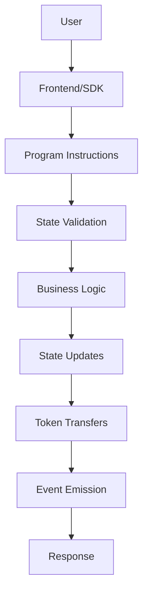

# Aura Lend Protocol - Development Guide

A comprehensive guide for developers working on or integrating with the Aura Lend Protocol.

## Table of Contents

- [Getting Started](#getting-started)
- [Architecture Overview](#architecture-overview)
- [Development Environment](#development-environment)
- [Code Structure](#code-structure)
- [Building and Testing](#building-and-testing)
- [Deployment Guide](#deployment-guide)
- [Contributing Guidelines](#contributing-guidelines)
- [Performance Optimization](#performance-optimization)
- [Security Considerations](#security-considerations)

## Getting Started

### Prerequisites

- **Rust**: 1.70.0 or later
- **Solana CLI**: 1.18.0 or later
- **Anchor Framework**: 0.30.1 or later
- **Node.js**: 18.0.0 or later
- **TypeScript**: 5.0 or later

### Installation

```bash
# Clone the repository
git clone https://github.com/aura-lend/protocol.git
cd aura-lend

# Install dependencies
npm install

# Install Rust dependencies
cargo build

# Install Solana CLI (if not already installed)
sh -c "$(curl -sSfL https://release.solana.com/v1.18.0/install)"

# Install Anchor (if not already installed)
npm install -g @coral-xyz/anchor-cli@0.30.1
```

### Quick Start

```bash
# Build the program
anchor build

# Start local validator
solana-test-validator

# Run tests
anchor test --provider.cluster localnet

# Deploy to local
anchor deploy --provider.cluster localnet
```

## Architecture Overview

### Core Components

The protocol consists of several key components:

```
├── programs/aura-lend/src/
│   ├── lib.rs                 # Main program entry point
│   ├── instructions/          # Instruction handlers
│   │   ├── market_instructions.rs
│   │   ├── lending_instructions.rs
│   │   ├── borrowing_instructions.rs
│   │   ├── liquidation_instructions.rs
│   │   ├── multisig_instructions.rs
│   │   ├── timelock_instructions.rs
│   │   └── governance_instructions.rs
│   ├── state/                 # Account structures
│   │   ├── market.rs
│   │   ├── reserve.rs
│   │   ├── obligation.rs
│   │   ├── multisig.rs
│   │   ├── timelock.rs
│   │   └── governance.rs
│   ├── utils/                 # Utility functions
│   │   ├── math.rs
│   │   ├── oracle.rs
│   │   ├── token.rs
│   │   ├── logging.rs
│   │   ├── metrics.rs
│   │   └── pagination.rs
│   ├── error.rs               # Error definitions
│   └── constants.rs           # Protocol constants
```

### Data Flow



### Key Concepts

1. **Market**: Global protocol state and configuration
2. **Reserve**: Asset-specific lending pool
3. **Obligation**: User's borrowing position
4. **aTokens**: Interest-bearing deposit tokens
5. **Health Factor**: Collateralization ratio
6. **RBAC**: Role-based access control system

## Development Environment

### Solana Configuration

```bash
# Set cluster
solana config set --url localhost              # Local development
solana config set --url https://api.devnet.solana.com  # Devnet testing
solana config set --url https://api.mainnet-beta.solana.com  # Mainnet

# Create wallet
solana-keygen new --outfile ~/.config/solana/id.json

# Get devnet tokens
solana airdrop 2
```

### Environment Variables

Create a `.env` file in the project root:

```bash
# Anchor configuration
ANCHOR_PROVIDER_URL=http://localhost:8899
ANCHOR_WALLET=~/.config/solana/id.json

# RPC endpoints
SOLANA_RPC_URL=http://localhost:8899
HELIUS_RPC_URL=https://rpc.helius.xyz/?api-key=your-key

# Oracle configuration
PYTH_PROGRAM_ID=gSbePebfvPy7tRqimPoVecS2UsBvYv46ynrzWocc92s
SWITCHBOARD_PROGRAM_ID=SW1TCH7qEPTdLsDHRgPuMQjbQxKdH2aBStViMFnt64f

# Development flags
DEBUG=true
LOG_LEVEL=debug
```

### VS Code Configuration

Create `.vscode/settings.json`:

```json
{
    "rust-analyzer.linkedProjects": [
        "./programs/aura-lend/Cargo.toml"
    ],
    "rust-analyzer.cargo.target": "bpf-unknown-unknown",
    "typescript.preferences.importModuleSpecifier": "relative",
    "editor.formatOnSave": true,
    "rust-analyzer.checkOnSave.command": "clippy"
}
```

## Code Structure

### Program Entry Point

```rust
// lib.rs
#[program]
pub mod aura_lend {
    use super::*;

    pub fn initialize_market(
        ctx: Context<InitializeMarket>,
        params: InitializeMarketParams,
    ) -> Result<()> {
        instructions::initialize_market(ctx, params)
    }
    
    // ... other instructions
}
```

### Instruction Pattern

```rust
// Example instruction structure
pub fn deposit_reserve_liquidity(
    ctx: Context<DepositReserveLiquidity>,
    liquidity_amount: u64,
) -> Result<()> {
    // 1. Validation
    require!(liquidity_amount > 0, LendingError::AmountTooSmall);
    
    // 2. Reentrancy protection
    let reserve = &mut ctx.accounts.reserve;
    reserve.try_lock()?;
    
    // 3. Business logic
    let result = (|| -> Result<()> {
        // Update interest
        reserve.update_interest(Clock::get()?.slot)?;
        
        // Calculate aToken amount
        let atoken_amount = reserve.calculate_atoken_amount(liquidity_amount)?;
        
        // Execute transfers
        TokenUtils::transfer_tokens(/*...*/)?;
        
        // Update state
        reserve.add_liquidity(liquidity_amount)?;
        
        Ok(())
    })();
    
    // 4. Cleanup
    reserve.unlock()?;
    result
}
```

### Account Structure Pattern

```rust
#[account]
pub struct Reserve {
    pub version: u8,
    pub market: Pubkey,
    // ... other fields
    pub reserved: [u8; 255], // For future upgrades
}

impl Reserve {
    pub const SIZE: usize = 8 + // discriminator
        1 + // version
        32 + // market
        // ... calculate all fields
        255; // reserved
        
    pub fn new(/* params */) -> Result<Self> {
        // Initialization logic
    }
    
    // Business logic methods
}
```

### Error Handling

```rust
#[error_code]
pub enum LendingError {
    #[msg("Math operation overflow")]
    MathOverflow,
    #[msg("Insufficient liquidity")]
    InsufficientLiquidity,
    // ... other errors
}

// Usage in code
require!(amount > 0, LendingError::AmountTooSmall);
```

## Building and Testing

### Build Commands

```bash
# Clean build
anchor clean && anchor build

# Build with specific program
anchor build --program-name aura-lend

# Build for specific cluster
anchor build --provider.cluster devnet

# Verify build
anchor verify aura-lend --provider.cluster devnet
```

### Testing Strategy

#### Unit Tests

```rust
#[cfg(test)]
mod tests {
    use super::*;
    
    #[test]
    fn test_interest_calculation() {
        let utilization = 8000; // 80%
        let interest_rate = calculate_interest_rate(utilization);
        assert_eq!(interest_rate, 400); // 4%
    }
}
```

#### Integration Tests

```typescript
// tests/lending.test.ts
describe("Lending Operations", () => {
    it("should deposit and earn interest", async () => {
        const depositAmount = 1000_000_000; // 1000 USDC
        
        // Execute deposit
        const tx = await program.methods
            .depositReserveLiquidity(new anchor.BN(depositAmount))
            .accounts({/* ... */})
            .rpc();
            
        // Verify state changes
        const reserve = await program.account.reserve.fetch(reservePubkey);
        assert.equal(reserve.state.totalLiquidity, depositAmount);
    });
});
```

#### Security Tests

```typescript
// tests/security.test.ts
describe("Security Tests", () => {
    it("should reject unauthorized operations", async () => {
        try {
            await program.methods
                .updateReserveConfig(newConfig)
                .accounts({ authority: unauthorizedUser })
                .rpc();
            assert.fail("Should have rejected unauthorized user");
        } catch (error) {
            expect(error.code).to.equal(6018); // InsufficientAuthority
        }
    });
});
```

### Test Commands

```bash
# Run all tests
npm run test:all

# Run specific test suites
npm run test:security
npm run test:governance
npm run test:performance

# Run with coverage
anchor test --coverage

# Run on different clusters
anchor test --provider.cluster devnet
```

### Continuous Integration

```yaml
# .github/workflows/test.yml
name: Tests
on: [push, pull_request]

jobs:
  test:
    runs-on: ubuntu-latest
    steps:
      - uses: actions/checkout@v3
      - uses: actions/setup-node@v3
        with:
          node-version: '18'
      
      - name: Install Solana
        run: |
          sh -c "$(curl -sSfL https://release.solana.com/v1.18.0/install)"
          echo "$HOME/.local/share/solana/install/active_release/bin" >> $GITHUB_PATH
      
      - name: Install Anchor
        run: npm install -g @coral-xyz/anchor-cli@0.30.1
      
      - name: Install dependencies
        run: npm install
      
      - name: Build program
        run: anchor build
      
      - name: Run tests
        run: anchor test
      
      - name: Run security tests
        run: npm run test:security
```

## Deployment Guide

### Local Deployment

```bash
# Start local validator with additional programs
solana-test-validator \
    --bpf-program gSbePebfvPy7tRqimPoVecS2UsBvYv46ynrzWocc92s pyth.so \
    --reset

# Deploy program
anchor deploy --provider.cluster localnet

# Initialize protocol
npm run initialize-local
```

### Devnet Deployment

```bash
# Set cluster
solana config set --url https://api.devnet.solana.com

# Deploy
anchor deploy --provider.cluster devnet

# Verify deployment
anchor verify aura-lend --provider.cluster devnet

# Initialize protocol
npm run initialize-devnet
```

### Mainnet Deployment

```bash
# Set cluster
solana config set --url https://api.mainnet-beta.solana.com

# Deploy with governance approval
npm run deploy:mainnet:proposal

# Execute after timelock
npm run deploy:mainnet:execute
```

### Upgrade Process

```bash
# 1. Build new version
anchor build

# 2. Deploy to buffer
solana program write-buffer target/deploy/aura_lend.so

# 3. Create upgrade proposal
npm run upgrade:proposal

# 4. Collect signatures
npm run upgrade:sign

# 5. Execute after timelock
npm run upgrade:execute

# 6. Migrate data
npm run migrate:all
```

## Contributing Guidelines

### Code Style

#### Rust Guidelines

```rust
// Use descriptive names
pub fn calculate_health_factor(obligation: &Obligation) -> Result<Decimal> {
    // Implementation
}

// Add comprehensive documentation
/// Calculates the health factor for an obligation
/// 
/// # Arguments
/// * `obligation` - The user's borrowing position
/// 
/// # Returns
/// * `Ok(Decimal)` - Health factor (1.0 = at liquidation threshold)
/// * `Err(LendingError)` - If calculation fails
pub fn calculate_health_factor(obligation: &Obligation) -> Result<Decimal> {
    // Implementation
}

// Use proper error handling
let result = risky_operation()
    .map_err(|_| LendingError::OperationFailed)?;

// Prefer explicit types
let amount: u64 = 1_000_000;
let rate: Decimal = Decimal::from_scaled_val(400); // 4%
```

#### TypeScript Guidelines

```typescript
// Use interfaces for complex types
interface DepositParams {
  reserve: PublicKey;
  amount: anchor.BN;
  userTokenAccount: PublicKey;
  userCollateralAccount: PublicKey;
}

// Use async/await consistently
async function depositToReserve(params: DepositParams): Promise<string> {
  try {
    const tx = await program.methods
      .depositReserveLiquidity(params.amount)
      .accounts({
        reserve: params.reserve,
        userTokenAccount: params.userTokenAccount,
        userCollateralAccount: params.userCollateralAccount,
      })
      .rpc();
    
    return tx;
  } catch (error) {
    throw new Error(`Deposit failed: ${error.message}`);
  }
}

// Use proper typing for program interactions
const reserveAccount: Reserve = await program.account.reserve.fetch(reservePubkey);
```

### Testing Requirements

1. **Unit Tests**: All utility functions must have unit tests
2. **Integration Tests**: All instructions must have integration tests
3. **Security Tests**: Critical paths must have security tests
4. **Performance Tests**: Gas usage must be within limits

### Documentation Requirements

1. **Code Documentation**: All public functions must be documented
2. **API Documentation**: All instructions must be documented
3. **Architecture Documentation**: Major changes require architecture docs
4. **Examples**: Complex features need usage examples

### Pull Request Process

1. **Create Feature Branch**: `git checkout -b feature/your-feature`
2. **Write Tests**: Ensure comprehensive test coverage
3. **Update Documentation**: Update relevant documentation
4. **Run Linting**: `npm run lint && npm run format`
5. **Run Tests**: `npm run test:all`
6. **Create PR**: Include detailed description and testing notes

## Performance Optimization

### Compute Unit Optimization

```rust
// Prefer stack allocation
let mut buffer = [0u8; 32];

// Avoid unnecessary allocations
let result = calculate_directly(input);
// instead of
let intermediate = create_intermediate(input);
let result = process_intermediate(intermediate);

// Use efficient data structures
use std::collections::BTreeMap; // for sorted keys
use std::collections::HashMap;  // for fast lookups
```

### Account Size Optimization

```rust
// Pack related fields together
#[repr(C)]
pub struct OptimizedStruct {
    pub flags: u8,        // 1 byte
    pub padding: [u8; 7], // 7 bytes padding
    pub amount: u64,      // 8 bytes (aligned)
    pub pubkey: Pubkey,   // 32 bytes
}

// Use appropriate integer sizes
pub struct Metrics {
    pub count: u32,      // u32 instead of u64 if range allows
    pub percentage: u16, // u16 for percentages (0-10000 basis points)
}
```

### RPC Optimization

```typescript
// Batch RPC calls
const [market, reserve, obligation] = await Promise.all([
  program.account.market.fetch(marketPubkey),
  program.account.reserve.fetch(reservePubkey),
  program.account.obligation.fetch(obligationPubkey),
]);

// Use preflight commitment for faster responses
const tx = await program.methods
  .depositReserveLiquidity(amount)
  .accounts({/* ... */})
  .rpc({ 
    commitment: 'processed',
    preflightCommitment: 'processed'
  });

// Cache static data
const cache = new Map<string, any>();
function getCachedAccount(pubkey: PublicKey) {
  const key = pubkey.toString();
  if (!cache.has(key)) {
    cache.set(key, program.account.reserve.fetch(pubkey));
  }
  return cache.get(key);
}
```

## Security Considerations

### Input Validation

```rust
// Always validate inputs
require!(amount > 0, LendingError::AmountTooSmall);
require!(amount <= MAX_AMOUNT, LendingError::AmountTooLarge);

// Validate account ownership
require!(
    account.owner == &crate::id(),
    LendingError::InvalidAccountOwner
);

// Check account initialization
require!(
    account.discriminator == Reserve::DISCRIMINATOR,
    LendingError::AccountNotInitialized
);
```

### Reentrancy Protection

```rust
impl Reserve {
    pub fn try_lock(&mut self) -> Result<()> {
        require!(!self.reentrancy_guard, LendingError::ReentrantCall);
        self.reentrancy_guard = true;
        Ok(())
    }
    
    pub fn unlock(&mut self) -> Result<()> {
        self.reentrancy_guard = false;
        Ok(())
    }
}

// Usage pattern
let reserve = &mut ctx.accounts.reserve;
reserve.try_lock()?;

let result = (|| -> Result<()> {
    // Critical section
    Ok(())
})();

reserve.unlock()?;
result
```

### Oracle Security

```rust
// Validate oracle data
pub fn validate_oracle_price(price: &OraclePrice) -> Result<()> {
    let clock = Clock::get()?;
    
    // Check staleness
    let age = clock.unix_timestamp - price.publish_time;
    require!(
        age <= MAX_ORACLE_STALENESS,
        LendingError::OraclePriceStale
    );
    
    // Check confidence
    let confidence_ratio = (price.confidence as u128)
        .checked_mul(10000)
        .ok_or(LendingError::MathOverflow)?
        .checked_div(price.price.abs() as u128)
        .ok_or(LendingError::DivisionByZero)?;
    
    require!(
        confidence_ratio <= MAX_CONFIDENCE_RATIO,
        LendingError::OracleConfidenceTooWide
    );
    
    Ok(())
}
```

### Access Control

```rust
// Use proper PDA validation
pub fn validate_reserve_pda(
    reserve_pubkey: &Pubkey,
    liquidity_mint: &Pubkey,
    program_id: &Pubkey,
) -> Result<()> {
    let (expected_pubkey, _bump) = Pubkey::find_program_address(
        &[RESERVE_SEED, liquidity_mint.as_ref()],
        program_id,
    );
    
    require!(
        reserve_pubkey == &expected_pubkey,
        LendingError::InvalidAccount
    );
    
    Ok(())
}
```

## Troubleshooting

### Common Build Issues

1. **Rust Version**: Ensure Rust 1.70.0+
2. **Anchor Version**: Use exactly 0.30.1
3. **Dependencies**: Run `cargo update` if build fails

### Common Test Issues

1. **RPC Errors**: Check if local validator is running
2. **Account Not Found**: Ensure proper initialization order
3. **Insufficient Funds**: Check account balances

### Common Deployment Issues

1. **Program Size**: Optimize code if program is too large
2. **Upgrade Authority**: Verify upgrade authority is correct
3. **Account Rent**: Ensure accounts have sufficient rent

### Debug Tools

```bash
# View program logs
solana logs <program-id>

# Inspect account data
solana account <account-pubkey>

# Decode instruction data
anchor decode <base64-instruction-data>

# View transaction details
solana confirm <transaction-signature> -v
```

---

*This development guide is continuously updated. For the latest information, check the official repository and documentation.*